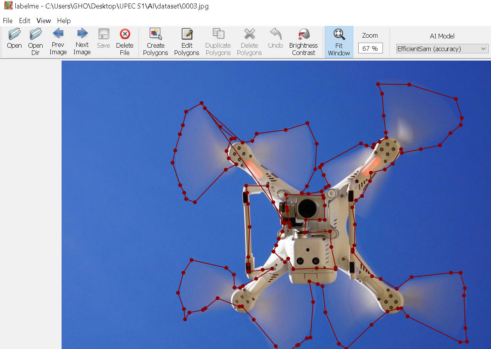
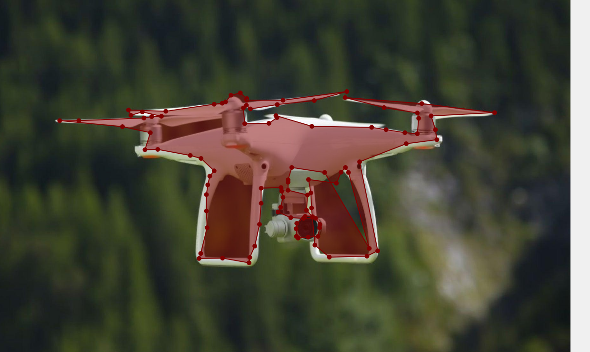
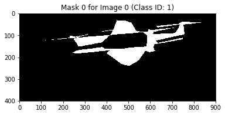
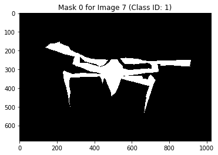
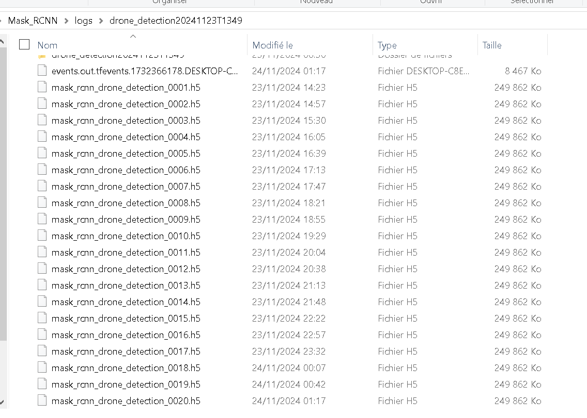
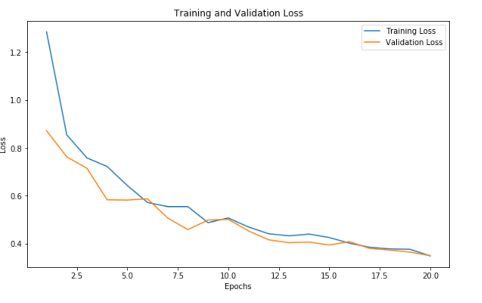
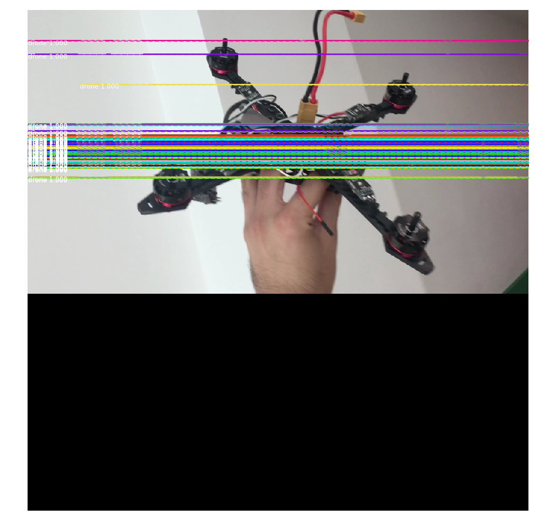
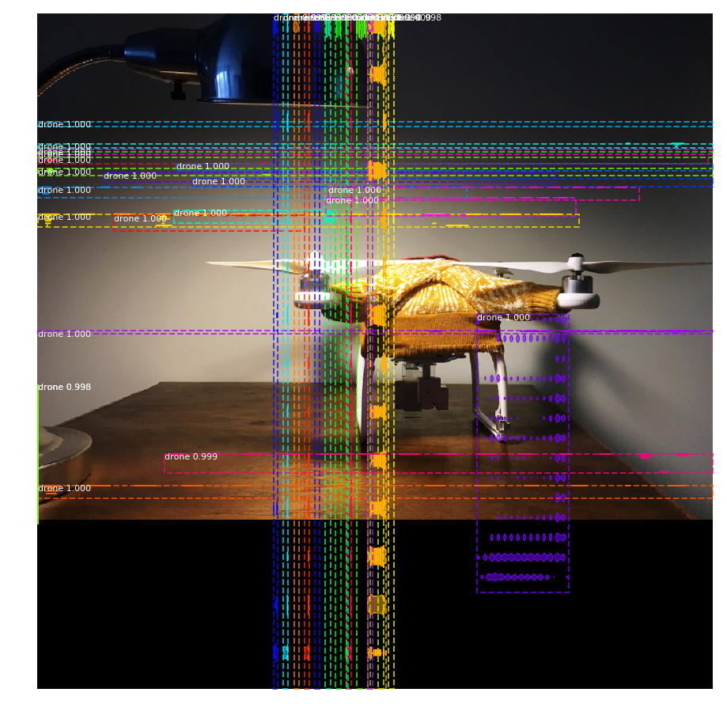
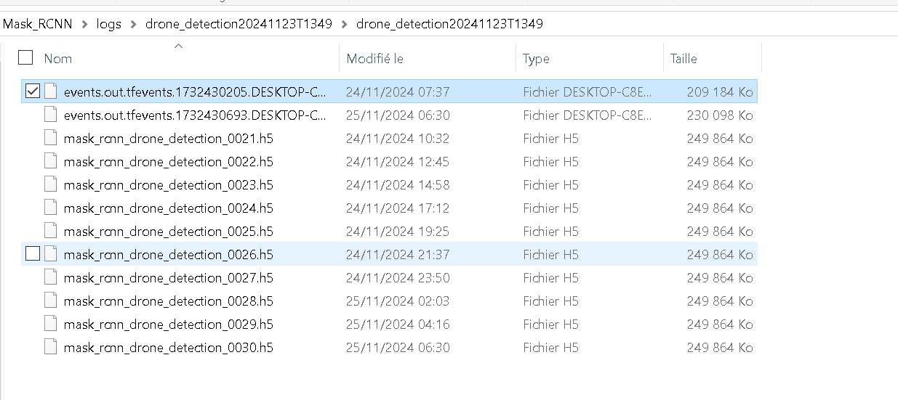

# Drone Detection with Mask R-CNN

This repository contains the implementation and training of a Mask R-CNN model for detecting drones in images. The model is built using Mask R-CNN implementation and trained on a custom drone dataset.

## Overview
The goal of this project is to accurately detect drones in images using a pre-trained COCO model and further fine-tune it on a custom dataset. The model's performance is evaluated based on various metrics, and its results are analyzed through different lenses.

## Dataset
- **Training Images**: 252 images labeled for training.
- **Validation Images**: 50 images labeled for validation.
- **Labelized**: with labelme 
- **Annotations**: Sample annotations with detailed labels for each object are shown below; however, the level of detail in these annotations may be quite complex.




## Displaying an Image and its Associated Masks

Below are examples showing an image from the dataset and its associated object masks. Each mask highlights a detected object, making it possible to visualize how well the model can segment and locate each object within the image.

**Example 1**:  
  

**Example 2**:  
  

Each mask shows individual objects, making it easier to observe object locations and contours in the images.

- **Annotations and Images**: 
  - Samples from the dataset are included in the `dataset` directory:
    - [Training images and annotations](dataset/train)
    - [Validation images and annotations](dataset/val)

## Model Architecture
The Mask R-CNN architecture is used with a ResNet backbone and consists of:
1. Region Proposal Network (RPN)
2. Mask Head for segmentation

## Training
- **Epochs**: 20 (each epoch takes approximately 2 hours, as shown in `training_logs.txt`)
- **Learning Rate**: 0.001 
- **Optimizer**: Adam
- **Batch Size**: 1 (due to GPU limitations)

## Hyperparameters
- **Detection Confidence Threshold**: 0.9
- **Steps per Epoch**: 100

## Jupyter Notebooks

This project includes two Jupyter notebooks for training and testing:

- **[train.ipynb](train.ipynb)**: This notebook contains the code and dataset for training the model. It includes preprocessing, model setup, and training steps and also the refine code.
- **[test.ipynb](test.ipynb)**: This notebook contains code for testing the trained model on real images. It allows you to evaluate the model's performance on new, unseen data.

## Training Logs
Below is an image showing the training logs generated for each epoch during the training process:
<br/>


## Results
- **Training Logs**: Included in the [train_logs.txt](train_logs.txt) file.
- **Confusion Matrix**: [Link to confusion matrix]
- **Loss Graph**: 
- **Test Images**: 

Below are examples of the model's predictions on test images. Each output includes the original image and the detected areas, highlighting where the model identified drones.

**Example Test Image 1**:  


**Example Test Image 2**:  


These examples demonstrate the model's capacity to detect drones within real-world images, although some segmentation results may be inaccurate or contain errors.


## Model Refinement

To improve the model’s performance, several key parameters were adjusted to optimize detection and segmentation of drones in the images. These refined settings were selected to make the model more sensitive to drone detection and enhance its efficiency given the available hardware constraints.

### Refinement Parameters

The following parameters were adjusted:

- **DETECTION_MIN_CONFIDENCE**: Reduced to `0.5` to detect a broader range of objects, making the model more sensitive to potential drone objects in images.
- **DETECTION_NMS_THRESHOLD**: Set to `0.4` to increase the precision of the model’s bounding box outputs and reduce overlapping detections.
- **STEPS_PER_EPOCH**: Increased to `150` for a higher number of training iterations per epoch, which improves model learning.
- **VALIDATION_STEPS**: Set to `25` to ensure sufficient validation checks during each epoch, providing a balanced assessment of model performance.

These refinements were implemented to achieve a better trade-off between detection accuracy and computational efficiency, allowing the model to perform effectively on the target dataset and accurately segment drones in various image conditions.

### Refinement Results

The model was refined over a span of 10 epochs, with training and validation metrics logged in the [`refine_logs.txt`](refine_logs.txt) file. This log file includes detailed metrics for each epoch, allowing further analysis of how the refinement affected model accuracy, loss, and detection quality. 

## Refinement Logs
Below is an image showing the refinement logs generated for each epoch during the refinement process:
<br/>



## Observations and Comments
The training process demonstrates a steady decline in both training and validation losses, reflecting effective learning and model performance. However, the RPN losses remain relatively elevated, indicating potential areas for improvement in anchor configurations or learning rate adjustments to enhance overall model efficacy.

## Getting Started

### Prerequisites
- Python 3.6 OR 3.7
- TensorFlow 1.x
- Keras 0.17.x
- scikit-image 2.1.x

### Installation
```sh
pip install -r requirements.txt
```


## 👥 Contributors

This drone detection project was developed as a collaborative effort:

- [**GHOMARI Mehdi**](mailto:mehdi.ghomari@etu.u-pec.fr)

- [**Aito Florentin Meignan**](mailto:aito-florentin.meignan@etu.u-pec.fr)


## 📚 References

- Mask R-CNN Paper: [arXiv:1703.06870](https://arxiv.org/abs/1703.06870)
- Original Mask R-CNN Implementation: [matterport/Mask_RCNN](https://github.com/matterport/Mask_RCNN)

## 📄 License

This project is licensed under the MIT License - see the [LICENSE](LICENSE) file for details.