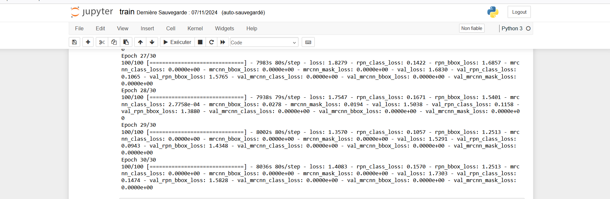

# Drone Detection with Mask R-CNN

This repository contains the implementation and training of a Mask R-CNN model for detecting drones in images. The model is built using Mask R-CNN implementation and trained on a custom drone dataset.

## 🎯 Overview
The goal of this project is to accurately detect drones in images using a pre-trained COCO model and further fine-tune it on a custom dataset. The model's performance is evaluated based on various metrics, and its results are analyzed through different lenses.

## 📊 Dataset
- **Training Images**: 252 images labeled for training.
- **Validation Images**: 50 images labeled for validation.
- **Annotation Tool**: labelme
- **Annotations**: Sample annotations with detailed labels for each object are shown below; however, the level of detail in these annotations may be quite complex.


## Dataset Structure

The dataset is organized into three main directories: [`train`](dataset/train), [`val`](dataset/val), and [`validation`](dataset/validation). Each folder serves a specific purpose for training, validation, and testing of the model:


### Directory Descriptions
- **[`train/`](dataset/train)**: Holds the training dataset with separate `images` and `annotations` directories.
- **[`val/`](dataset/val)**: Contains the validation dataset, organized with `images` and `annotations`.
- **[`validation/`](dataset/validation)**: Contains only test images in the `images` directory, used for final evaluation.

> **Note**: The `validation` folder includes only images, as it is typically used to assess model performance on unseen data without labels.


## Displaying an Image and its Associated Masks

Below are examples showing an image from the dataset and its associated object masks. Each mask highlights a detected object, making it possible to visualize how well the model can segment and locate each object within the image.

**Example 1**:  
  

**Example 2**:  
  

Each mask shows individual objects, making it easier to observe object locations and contours in the images.


## 🧠 Model Architecture
The Mask R-CNN architecture is used with a ResNet backbone and consists of:
1. Region Proposal Network (RPN)
2. Mask Head for segmentation

## 🚂 Training
- **Epochs**: 20 (each epoch takes approximately 2 hours)
- **Learning Rate**: 0.001 
- **Optimizer**: Adam
- **Batch Size**: 1 (due to GPU limitations)

## 🎛️ Hyperparameters
- **Detection Confidence Threshold**: 0.9
- **Steps per Epoch**: 100

## 📓 Jupyter Notebooks

This project includes two Jupyter notebooks for training and testing:

- **[train.ipynb](train.ipynb)**: This notebook contains the code and dataset for training the model. It includes preprocessing, model setup, and training steps and also the refine code.
- **[test.ipynb](test.ipynb)**: This notebook contains code for testing the trained model on real images. It allows you to evaluate the model's performance on new, unseen data.


## 📈 Results

## Training Logs

Below are screenshots of the training logs generated during the training process. These logs show the progression of the training and the losses calculated at each epoch:

1. **Training Log (Epoch 1-4)**  
   

2. **Training Log (Epoch 5-8)**  
   

3. **Training Log (Epoch 9-12)**  
   

4. **Training Log (Epoch 13-16)**  
   

4. **Training Log (Epoch 17-20)**  
   

Below is an image showing the files generated during the training process. These files include the model checkpoints saved at each epoch, which can be used for further evaluation or fine-tuning.
<br/>


- **Confusion Matrix**: 

The confusion matrix below represents the results of our drone detection model on the test dataset. As shown, all values in the matrix are zero, which indicates that the model did not make any correct or incorrect predictions for either the "background" or "drone" classes in this particular evaluation.


- **Loss Graph**: 
- **Test Images**: 

Below are examples of the model's predictions on test images. Each output includes the original image and the detected areas, highlighting where the model identified drones.

**Example Test Image 1**:  


**Example Test Image 2**:  


These examples demonstrate the model's capacity to detect drones within real-world images, although some segmentation results may be inaccurate or contain errors.


## 🛠️ Model Refinement

To improve the model’s performance, several key parameters were adjusted to optimize detection and segmentation of drones in the images. These refined settings were selected to make the model more sensitive to drone detection and enhance its efficiency given the available hardware constraints.

### 🔄 Refinement Parameters

The following parameters were adjusted:

- **DETECTION_MIN_CONFIDENCE**: Reduced to `0.5` to detect a broader range of objects, making the model more sensitive to potential drone objects in images.
- **DETECTION_NMS_THRESHOLD**: Set to `0.4` to increase the precision of the model’s bounding box outputs and reduce overlapping detections.
- **STEPS_PER_EPOCH**: Increased to `150` for a higher number of training iterations per epoch, which improves model learning.
- **VALIDATION_STEPS**: Set to `25` to ensure sufficient validation checks during each epoch, providing a balanced assessment of model performance.

These refinements were implemented to achieve a better trade-off between detection accuracy and computational efficiency, allowing the model to perform effectively on the target dataset and accurately segment drones in various image conditions.

### 📋 Refinement Results

Below are screenshots of the refinement logs generated during the refinement process. These logs show the progression of the training and the losses calculated at each epoch:

1. **Refinement Log (Epoch 1-5)**  
   

2. **Refinement Log (Epoch 6-10)**  
   

Below is an image showing the files generated during the refinement process. These files include the model checkpoints saved at each epoch, which can be used for further evaluation or fine-tuning.


- **Refinement Graph**: 


## 📝 Observations and comments

The training process demonstrates a **steady decline** in both training and validation losses, reflecting **effective learning** and **model performance**. However, the **RPN losses** remain relatively elevated, particularly the **RPN bounding box loss**, which suggests that the model is struggling to accurately regress the bounding boxes for proposals. This could be due to **suboptimal anchor configurations** or an **insufficient learning rate** for the RPN.

Additionally, the model's performance may be hindered by **underfitting**, as indicated by the relatively high validation losses. One potential cause of this is the **complexity of the annotations** on the images. The dataset includes many **overlapping instances** and intricate boundaries, which can make it difficult for the model to learn effective segmentation. To address this, we could explore **simplifying the annotations** by reducing the number of overlapping instances and creating clearer boundaries.

Our dataset lacks **diversity**, as we only used images of drones in **ideal positions**. To improve **dataset robustness** and **model generalization**, we could diversify by adding images that include **no drones** (negative samples), **partially visible drones**, or **drones alongside objects** that could resemble drones. This approach would help address **false positives** and improve **detection accuracy** in **real-world scenarios**.

To **improve model performance**, we could also consider refining our **data augmentation strategy**. Techniques such as **random cropping**, **flipping**, and **rotation** could help increase the diversity of the training data and improve the model's ability to generalize. Additionally, we could explore **adjusting the model architecture** to better capture the intricacies of the dataset, such as by increasing the depth of the backbone network or adding more layers to the RPN.

In terms of quantitative analysis, it's encouraging to note that the **mrcnn_class_loss** and **mrcnn_bbox_loss** have both decreased significantly over the course of training, indicating that the model is learning to **classify** and **regress bounding boxes** more accurately. However, the final losses are still higher than those achieved in some previous experiments, suggesting that there is still **room for improvement**.


## 🚀 Getting Started

### Prerequisites
- Python 3.6 OR 3.7
- TensorFlow 1.x
- Keras 0.17.x
- scikit-image 2.1.x

### Installation
```sh
pip install -r requirements.txt
```


## 👥 Contributors

This drone detection project was developed as a collaborative effort:

- [**GHOMARI Mehdi**](mailto:mehdi.ghomari@etu.u-pec.fr)

- [**MEIGNAN Aito Florentin**](mailto:aito-florentin.meignan@etu.u-pec.fr)


## 📚 References

- Mask R-CNN Paper: [arXiv:1703.06870](https://arxiv.org/abs/1703.06870)
- Original Mask R-CNN Implementation: [matterport/Mask_RCNN](https://github.com/matterport/Mask_RCNN)

## 📄 License

This project is licensed under the MIT License - see the [LICENSE](LICENSE) file for details.